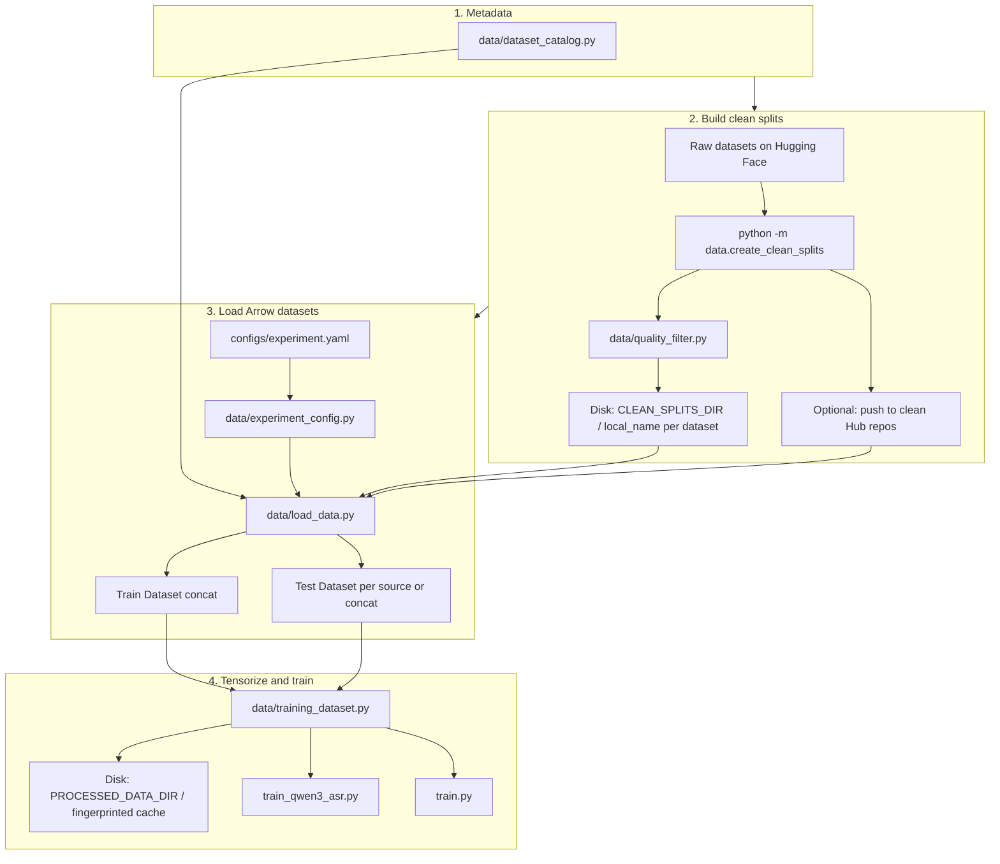

# Eskulap-a: Polish Medical ASR

Fine-tuning ASR models (Whisper, Qwen3-ASR) for Polish medical domain.

## Setup

```bash
# Install dependencies
uv sync

# Configure paths in .env (optional)
cp .env.example .env
```

## Data

Training and evaluation use **clean** train/test splits: fixed test rows for benchmarking, quality filtering and deduplication applied at **build** time. Training only ever draws from those clean train splits (subsampled per [`configs/experiment.yaml`](configs/experiment.yaml)); it does not pull raw, unfiltered corpora.

### Available Datasets

| Dataset | Description | Train | Test |
|---------|-------------|-------|------|
| admed_anoni | Medical reports - SALT anonymized audio | ~15k | ~1.5k |
| admed_human | Medical reports - human recordings | ~6k | ~1.5k |
| youtube | YouTube medical content | ~7k | ~800 |
| gemini | Gemini-generated medical transcriptions | ~2k | ~200 |
| bigos | General domain Polish speech | ~20k | ~2k |

Each row above is one **catalog entry** with its own frozen `train` / `test` splits after the build step.

### End-to-end: raw Hub data → training

Below is the full path: which files decide what, which command runs when, and where artifacts land.



**Step 1 — Catalog (single source of truth)**  
[`data/dataset_catalog.py`](data/dataset_catalog.py) lists every logical dataset (`admed_anoni`, …):

- **Producer fields** — raw Hub id/split, whether to run quality filtering, caps, shared-text groups (for joint train/test so text does not leak across corpora).
- **Consumer fields** — where **clean** data lives after the build (Hub repo + config name, and the **`local_name`** subdirectory used on disk).

Adding a new corpus = add one entry here, then run the build step for that id.

**Step 2 — Build (offline; quality + dedup + fixed test)**  
Command:

```bash
uv run python -m data.create_clean_splits --datasets admed_anoni admed_human youtube gemini bigos
```

- **Implements:** [`data/create_clean_splits.py`](data/create_clean_splits.py) calls [`data/quality_filter.py`](data/quality_filter.py) where configured, writes one **`DatasetDict`** per dataset (`train` + `test`) under:
  - **`CLEAN_SPLITS_DIR`** (default `/mnt/data/Eskulap-a/clean_splits`), each subset in a folder named by `local_name` (e.g. `anoni`, `youtube`).
- **Optional publish:** `--push --repo-id <org>/<dataset>` uploads the same splits so others (or CI) can `load_dataset` without rebuilding.

Raw inputs come from the **producer** paths in the catalog; outputs are what training will ever see as “allowed rows.”

**Step 3 — Load (every train / benchmark run)**  
[`data/load_data.py`](data/load_data.py) + [`data/experiment_config.py`](data/experiment_config.py):

- Reads [`configs/experiment.yaml`](configs/experiment.yaml) (`train:` / `test:` / `evaluation:`).
- For each enabled dataset, loads **`train`** or **`test`** from:
  1. **`DATASET_CACHE_DIR` / `<local_name>`** if present (same layout as build output — preferred for a single machine), else  
  2. **`load_dataset`** on the **clean** Hub path from the catalog (not the raw producer path).

So: **local mirror OR published clean splits** — both are the same split definition. Optional `max_samples` under `train:` only **subsamples** that dataset’s clean **train** split before concatenation (mix-and-match proportions). Rows never come from outside the built clean train sets.

**Step 4 — Tensorize + train**  
[`train.py`](train.py) / [`train_qwen3_asr.py`](train_qwen3_asr.py):

- Pass `--config configs/experiment.yaml`.
- Resolve cache dir: **`PROCESSED_DATA_DIR`** (default `/mnt/data/Eskulap-a/processed_data`) + fingerprinted subdirectory via [`data/training_dataset.py`](data/training_dataset.py) (depends on config file + model + `evaluation.inner_dev_from_train`).
- **Eval split:** With `evaluation.inner_dev_from_train: false` (default), the tensorized **test** split is built from enabled **`test:`** sources — same fixed benchmark rows as step 2. With `true`, a legacy dev slice is carved from the training concat by unique text.

### Environment paths (optional overrides)

| Variable | Role | Default (if unset) |
|----------|------|---------------------|
| `CLEAN_SPLITS_DIR` | Where `create_clean_splits` writes `DatasetDict` folders | `/mnt/data/Eskulap-a/clean_splits` |
| `DATASET_CACHE_DIR` | Where `load_data` looks first for those folders | `/mnt/data/Eskulap-a/clean_splits` |
| `PROCESSED_DATA_DIR` | Cached tensorized `DatasetDict` for training | `/mnt/data/Eskulap-a/processed_data` |
| `HF_HOME` | HF Datasets cache when downloading | system default |

Set these in your shell or `.env` if your machine does not use the default mount.

### Quick reference: stages vs scripts

| Stage | Responsibility | Scripts / modules |
|-------|----------------|-------------------|
| Build | Raw → leak-free train/test, filter, dedup, save/push | `python -m data.create_clean_splits`, `data/quality_filter.py` |
| Load | Clean → Arrow, normalize columns/text, concat per YAML | `data/load_data.py`, `data/experiment_config.py`, YAML |
| Tensorize | Arrow → model inputs + disk cache | `data/training_dataset.py`, `train.py`, `train_qwen3_asr.py` |

More detail: [`docs/data_pipeline.md`](docs/data_pipeline.md).

### Loading Data (API)

```python
from data import load_train_data, load_test_data

# Load admed datasets
train = load_train_data(admed_anoni=True, admed_human=True)

# Load all available training data
train = load_train_data(admed_anoni=True, admed_human=True, youtube=True, gemini=True)

# Load with sample limits (from each corpus’s clean train split only)
train = load_train_data(admed_anoni=1000, admed_human=500, youtube=500)

# Load from config file (recommended — matches training)
train = load_train_data(config_path="configs/experiment.yaml")

# Load test splits (fixed benchmark rows from clean artifacts)
test = load_test_data(admed_anoni=True, admed_human=True)
```

### Creating / Regenerating Splits

To rebuild clean train/test splits from **raw** Hugging Face sources (see catalog for exact ids):

```bash
# Default dataset list (see create_clean_splits --help)
uv run python -m data.create_clean_splits

# Specific datasets
uv run python -m data.create_clean_splits --datasets youtube gemini bigos

# All catalog datasets
uv run python -m data.create_clean_splits --datasets admed_anoni admed_human youtube gemini bigos

# Publish clean splits (example repo; adjust --repo-id per push target)
uv run python -m data.create_clean_splits --datasets admed_anoni admed_human --push --repo-id lion-ai/admed_voice_clean
```

## Configuration

This is the **experiment** layer (after clean splits exist): which clean sources to use, how many rows per source, and how eval is defined. [`train.py`](train.py) / [`train_qwen3_asr.py`](train_qwen3_asr.py) and [`benchmark.py`](benchmark.py) read the same style of config for loading data.

Experiment configs live in `configs/`:

```yaml
# configs/experiment.yaml
name: "medical_asr_v1"

evaluation:
  inner_dev_from_train: false   # use held-out test: sets (recommended)

model:
  type: "qwen3-asr"
  max_duration_seconds: 30.0

train:
  admed_anoni:
    enabled: true
  admed_human:
    enabled: true

test:
  admed_anoni:
    enabled: true
  admed_human:
    enabled: true
```

You can limit samples per dataset:

```yaml
train:
  admed_anoni:
    enabled: true
    max_samples: 5000
  admed_human:
    enabled: true
    max_samples: 2000
```

## Training

### Qwen3-ASR

```bash
uv run python train_qwen3_asr.py
```

### Whisper / GLM-ASR

```bash
uv run python train.py
```

## Benchmarking

Evaluate models on test sets:

```bash
# Default model (Qwen3 + LoRA)
uv run python benchmark.py

# Use config file
uv run python benchmark.py --config configs/experiment.yaml

# Use specific model
uv run python benchmark.py --model Qwen/Qwen3-ASR-1.7B

# Use a LoRA adapter (auto-detected)
uv run python benchmark.py --model models/my-lora-checkpoint

# Use Whisper
uv run python benchmark.py --model-type whisper --model openai/whisper-large-v3-turbo

# Specify test sets directly
uv run python benchmark.py --test-sets admed_anoni admed_human

# Save results
uv run python benchmark.py --save

# With LM rescoring (Whisper + Bielik n-best rescoring)
uv run python benchmark.py --model-type whisper --model openai/whisper-large-v3-turbo \
    --rescore --test-sets admed_human

# Custom rescoring parameters
uv run python benchmark.py --model-type whisper --model openai/whisper-large-v3-turbo \
    --rescore --lm-model speakleash/Bielik-1.5B-v3 --lm-weight 0.35 \
    --num-beams-rescore 8 --lm-batch-size 8 --test-sets admed_human
```

### LM Rescoring

The `--rescore` flag enables n-best rescoring for Whisper models. It generates multiple hypotheses via beam search, scores each with a causal language model, and picks the best by combined ASR + LM score.

| Option | Default | Description |
|--------|---------|-------------|
| `--rescore` | off | Enable LM rescoring |
| `--lm-model` | `speakleash/Bielik-1.5B-v3` | Causal LM for rescoring |
| `--lm-weight` | `0.35` | LM interpolation weight (0 = ASR only, 1 = LM only) |
| `--num-beams-rescore` | `8` | Beam count for n-best generation |
| `--lm-batch-size` | `8` | Batch size for LM scoring |

### Output

```
======================================================================
BENCHMARK RESULTS
======================================================================
Model: Qwen/Qwen3-ASR-1.7B+checkpoint-7350

Test Set                  WER          CER          Samples
----------------------------------------------------------------------
admed_anoni               0.1109       0.0548       1500
admed_human               0.1234       0.0612       1500
----------------------------------------------------------------------
Average (weighted)        0.1172       0.0580       3000
======================================================================
```

## Project Structure

```
data/
├── __init__.py            # Module exports
├── dataset_catalog.py    # Single source of truth for dataset metadata
├── load_data.py          # Load clean splits (consumer registry)
├── training_dataset.py   # Shared processed-dataset cache + map/chunked prep
├── experiment_config.py  # YAML experiment loader (+ evaluation settings)
├── create_clean_splits.py # Raw → clean splits (producer)
└── quality_filter.py     # Text/audio deduplication

eval/
└── llm_rescore.py        # Whisper n-best + LM rescoring (used by benchmark.py)

configs/
├── experiment.yaml       # Training/test configuration
└── default-whisper.yaml  # Legacy alternate layout (typo fix: was default-whsiper)

train.py                  # Whisper/GLM-ASR training
train_qwen3_asr.py        # Qwen3-ASR training
train_unsloth.py          # Legacy Unsloth path (see script docstring)
benchmark.py              # Model evaluation
app.py                    # Gradio demo app
whisper_llm_rescore_demo.py  # Thin CLI → eval.llm_rescore
```

## Gradio App

```bash
uv run python app.py
```

Launches a web interface for testing transcription.
